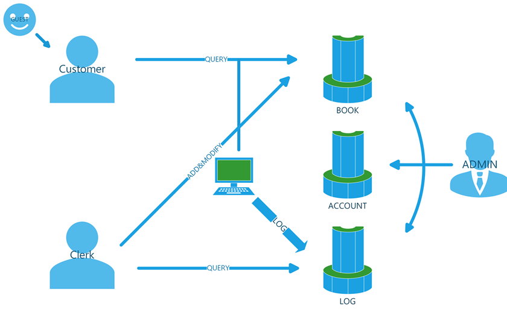

# 需求分析
## 账户系统
须实现：        
1. 权限hierarchy：游客、顾客、员工与店长；
2. 登录（栈），即当前用户信息的存储与处理；
3. 账户信息注册、存储。

## 图书系统
1. 员工：图书信息数据的存储与修改；
2. 顾客：数据的快速搜寻。

## 操作记录
1. 存储每次操作的 log 文件；
2. 能够根据一定条件列出。

## 输入输出与存储
1. 输入检查与异常处理；
2. 存储（线性链表）的排列架构。

## 图示

## 希望实现的Bonus：UTF-8支持
需要实现 Codepoint 与 UTF-8 互转；读取处理；字符串合法性判定；长度计算。
